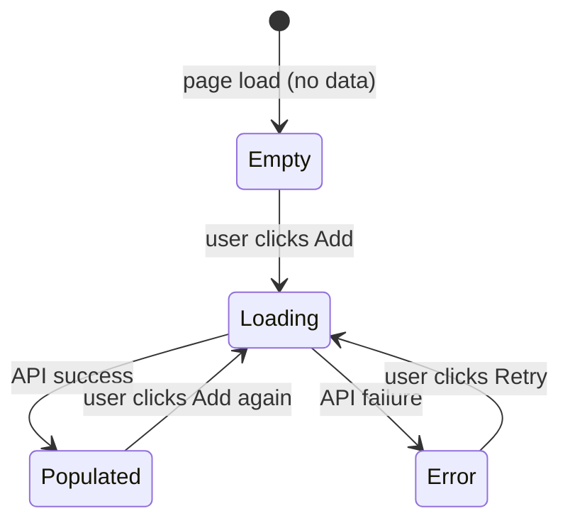

# GUI Spec

Elicits GUI specifications through structured dialogue, then generates Playwright acceptance tests that allow autonomous implementation and self-verification.

## Important Behaviors

- **Auto-decide, then confirm once**: Reason through all aspects autonomously, auto-select when recommendations are clear, and present a single summary for user confirmation. Only ask individual questions when a design decision is genuinely ambiguous with meaningful trade-offs.
- **Diagram before tests**: Present the state diagram as part of the scenario summary. Tests derived from an unconfirmed diagram will likely be wrong.
- **Two test files per Story**: E2E tests (real server, acceptance criteria) and mock tests (error/edge cases). Never mix them in the same file.
- **E2E tests trace to acceptance criteria**: Every E2E test name must start with `[AC-{StoryID}-{N}]` matching an acceptance criterion in ROADMAP.json. Every acceptance criterion must have at least one E2E test.
- **data-testid is mandatory**: If the implementation doesn't have `data-testid` attributes, Playwright tests become fragile. This is a non-negotiable convention.
- **Short-circuit if no GUI**: If no Stories in the Sprint involve GUI, skip immediately and return to `sprint plan`.
- **Autonomous mode**: When invoked from `sprint auto`, skip all user confirmation steps. Auto-decide every aspect, write the spec document, and log decisions to `decisions.json`.
- **Read the handler, not the type name**: Always read the actual backend handler for response field names. Never infer from type names or frontend conventions.
- **Assert POST bodies in mock tests**: For every mutation, inspect `route.request().postDataJSON()` and assert required fields. In E2E tests, verify via GET that the mutation persisted instead.

## When to Use

Called from `sprint plan` when one or more Stories involve GUI work. Do **not** call this during `sprint run` or `sprint verify` — specs must be finalized before implementation begins.

## Process

### Phase 1: Detect GUI Stories

Analyze the Sprint's Stories and Tasks. A Story involves GUI if it mentions:
- Component, screen, page, view, form, modal, dialog, drawer, panel
- UI, UX, frontend, React, htmx
- "display", "show", "render", "interact", "click", "input"

If no GUI Stories are found, skip this skill entirely and return to `sprint plan`.

### Phase 2: Derive Scenarios (one Story at a time)

For each GUI Story, reason through the following aspects and **auto-select the recommended approach** when a clear best practice or conventional answer exists. Only ask the user when a genuinely ambiguous design decision arises (e.g., multiple viable UX patterns with real trade-offs, domain-specific behavior that cannot be inferred from context).

**Aspects to reason through (adapt to context):**

1. **Entry point**: How does the user reach this UI? (direct URL, button click, navigation menu, etc.)
2. **Happy path**: The primary action flow — what the user does step by step and what happens after each step
3. **Data states**: What the UI shows when there is no data, when loading, and when an error occurs
4. **Edge cases**: Inputs or actions the UI should prevent or handle specially (empty fields, long strings, duplicate entries, etc.)
5. **Success feedback**: What the user sees after a successful action (toast, redirect, inline update, etc.)
6. **Failure feedback**: What the user sees when the action fails (server error, validation error, etc.)

**Auto-decision principle**: For each aspect, first determine if there is a clear recommendation based on existing project conventions, common UX patterns, or the Story context. If so, state your choice and rationale briefly and move on. If the decision is genuinely ambiguous (multiple viable approaches with meaningful trade-offs), ask the user — but batch related questions into a single message rather than asking one at a time.

Present the complete scenario summary (auto-decided items + any questions) to the user for a single confirmation pass, rather than iterating through each item individually.

**Autonomous mode** (when called from `sprint auto`): Skip the user confirmation pass entirely. Auto-decide all aspects, generate the state diagram and tests, and log all decisions to the Sprint's `decisions.json`. The scenario summary is still written to the spec document for post-hoc review, but no user interaction occurs.

### Phase 3: Generate State Transition Diagram

Based on the elicited scenarios, generate a Mermaid state diagram covering:
- All UI states (empty, loading, populated, error, submitting, success)
- All user actions that trigger transitions
- Which interactive elements (buttons, inputs) are enabled/disabled in each state

Present the diagram to the user as part of the scenario summary. If the user identifies missing states or transitions, update accordingly.

**Example output:**


### Phase 4: Generate Playwright Tests (2 types)

Generate **two separate test files** per GUI Story. Each serves a different purpose and runs at a different phase.

#### 4A: E2E Tests — `tests/e2e/{story-slug}.e2e.spec.ts`

Real end-to-end tests that run against the actual server (no mocks). These verify that the full stack works together.

**Rules for E2E tests:**
- Use `data-testid` attributes for all selectors (never CSS classes or text content)
- **No `page.route()` mocks** — tests hit the real backend
- Cover: happy path and every acceptance criterion from the ROADMAP
- **Name tests with acceptance criterion reference**: `[AC-{StoryID}-{N}] {description}` (e.g., `[AC-S002-1-1] should show VM list after login`). This enables traceability from acceptance criteria → test.
- Each test must set up its own test data via API calls in `test.beforeEach()` and clean up in `test.afterEach()`
- Tests assume the server is already running (`make serve`) — do not start the server within tests
- Use a dedicated test user/token for authentication (documented in CLAUDE.md)
- For mutations (POST/PUT/PATCH), verify the change persisted by reading back via GET

For examples, see [references/test-examples.md](references/test-examples.md).

**When E2E tests run**: During `sprint verify` (after all Stories are merged and the server is running).

#### 4B: Mock Tests — `tests/e2e/{story-slug}.mock.spec.ts`

Frontend-only tests using `page.route()` mocks. These verify UI behavior for states that are hard to reproduce with a real server.

**Rules for mock tests:**
- Cover: empty state, loading state, error state (500, timeout), edge cases (long strings, special characters)
- Use `page.route()` to mock API responses
- **Mock all dependent endpoints**: Explicitly mock every endpoint the component calls
- **Mock data must match real API contract**: Read the backend handler to confirm response structure
- **Verify all mocked endpoints are actually called**: Assert mock handlers were called
- **Assert mutation request bodies**: For POST/PUT/PATCH, inspect `route.request().postDataJSON()` and assert required fields
- Name tests in the format: `[MOCK] {scenario} should {expected behavior}`

For examples, see [references/test-examples.md](references/test-examples.md).

**When mock tests run**: During `sprint run` (per-Story, fast feedback loop).

### Phase 4.5: Endpoint contract table

For each GUI Story, produce an endpoint contract and include it in the spec JSON file (`docs/sprint-logs/{SprintID}/gui-spec-{StoryID}.json`). The structure follows `endpoint_contracts` in SPRINT_LOGS_SCHEMA.json:

```json
{
  "endpoint_contracts": [
    {
      "path": "/api/v1/vms",
      "method": "GET",
      "registered": true,
      "request_fields": null,
      "response_fields": {"items": "VM[]", "next_cursor": "string"}
    }
  ]
}
```

**How to fill**:
- Read the project's router file (e.g., `internal/api/router.go` for Go, `config/routes.rb` for Rails, `src/routes/` for Express) to confirm each endpoint is registered.
- Read the corresponding handler function to extract the exact field names from serialization annotations.
- The frontend API types **must** match `response_fields` exactly.

For POST/PUT/PATCH, `request_fields` defines what mock tests **must** assert via `route.request().postDataJSON()`. If left null, tests cannot verify the request body.

If any endpoint has `"registered": false`, flag it to `sprint plan` as a missing backend task.

### Phase 5: Update Roadmap and Write Spec

1. **Update `docs/ROADMAP.json`**: Add GUI-specific acceptance criteria to each GUI Story's `acceptance_criteria` array:
   - State diagram confirmed
   - Mock tests pass
   - E2E tests pass (during sprint verify)
   - All interactive elements have `data-testid` attributes
   - Every AC has a corresponding `[AC-*]` tagged E2E test

2. **Write spec file**: Write the full spec output to `docs/sprint-logs/{SprintID}/gui-spec-{StoryID}.json` following the `gui_spec` structure in SPRINT_LOGS_SCHEMA.json. This includes: state diagram (Mermaid string), scenarios, endpoint contracts, and test file paths.

Create the sprint-logs directory if it doesn't exist.

## Output Contract

This skill produces:
1. Confirmed Mermaid state diagram per GUI Story
2. E2E test file at `tests/e2e/{story-slug}.e2e.spec.ts` — real server tests for acceptance criteria
3. Mock test file at `tests/e2e/{story-slug}.mock.spec.ts` — error/edge case tests with mocks
4. Spec document at `docs/sprint-logs/{SprintID}/gui-spec-{StoryID}.json`
5. Updated acceptance criteria in `docs/ROADMAP.json`

`sprint run` implementation sub-agents must:
- Add `data-testid` to every interactive element
- Run `npx playwright test {story-slug}.mock.spec.ts` and fix failures before marking the Story complete
- E2E tests (`*.e2e.spec.ts`) are NOT run during sprint run — they run during sprint verify against the real server

## Reference Files

- `references/test-examples.md` — E2E and mock test code examples
