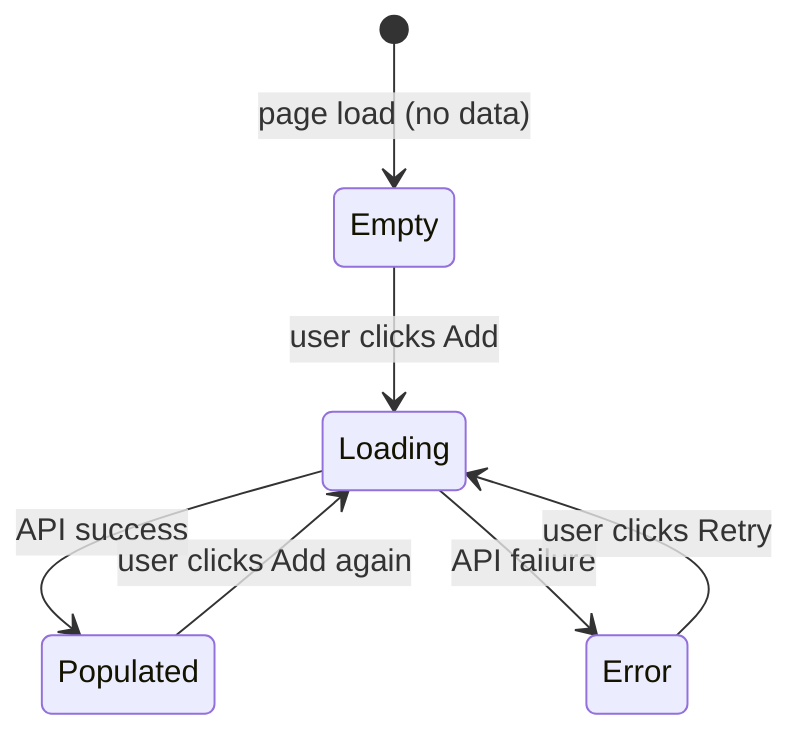

# GUI Spec

Elicits GUI specifications through structured dialogue, then generates Playwright acceptance tests that allow autonomous implementation and self-verification.

## When to Use

Called from `sprint plan` when one or more Stories involve GUI work. Do **not** call this during `sprint run` or `sprint verify` — specs must be finalized before implementation begins.

## Process

### Phase 1: Detect GUI Stories

Analyze the Sprint's Stories and Tasks. A Story involves GUI if it mentions:
- Component, screen, page, view, form, modal, dialog, drawer, panel
- UI, UX, frontend, React, htmx
- "display", "show", "render", "interact", "click", "input"

If no GUI Stories are found, skip this skill entirely and return to `sprint plan`.

### Phase 2: Elicit Scenarios (one Story at a time)

For each GUI Story, conduct a structured dialogue with the user. Ask **one question at a time** and wait for the response before asking the next.

**Required questions (adapt wording to context):**

1. **Entry point**: How does the user reach this UI? (direct URL, button click, navigation menu, etc.)
2. **Happy path**: Walk me through the primary action — what does the user do, step by step, and what happens after each step?
3. **Data states**: What should the UI show when there is no data yet? When data is loading? When an error occurs?
4. **Edge cases**: Are there any inputs or actions the UI should prevent or handle specially? (empty fields, long strings, duplicate entries, etc.)
5. **Success feedback**: After a successful action, what does the user see? (toast, redirect, inline update, etc.)
6. **Failure feedback**: If the action fails (e.g., server error), what does the user see?

Stop asking if the user says "that's enough" or "no more edge cases". Do not ask all questions if earlier answers already cover later ones.

### Phase 3: Generate State Transition Diagram

Based on the elicited scenarios, generate a Mermaid state diagram covering:
- All UI states (empty, loading, populated, error, submitting, success)
- All user actions that trigger transitions
- Which interactive elements (buttons, inputs) are enabled/disabled in each state

Present the diagram to the user and ask: "Does this capture all the states correctly?"

If the user identifies missing states or transitions, update the diagram and re-present. Repeat until the user confirms.

**Example output:**


### Phase 4: Generate Playwright Acceptance Tests

Convert the confirmed scenarios and state diagram into Playwright test cases. Write these as concrete, runnable test code.

**Rules for generated tests:**
- Use `data-testid` attributes for all selectors (never CSS classes or text content)
- Cover: happy path, empty state, loading state, error state, each edge case identified
- Use `page.route()` to mock API responses — do not depend on a real backend
- Each test must be independent (no shared state between tests)
- Name tests in the format: `「シナリオ名」should [expected behavior]`

**Example:**
```typescript
import { test, expect } from '@playwright/test';

test('VM list: should show empty state when no VMs exist', async ({ page }) => {
  await page.route('/api/vms', route => route.fulfill({ json: [] }));
  await page.goto('/vms');
  await expect(page.getByTestId('empty-state-message')).toBeVisible();
  await expect(page.getByTestId('create-vm-button')).toBeEnabled();
});

test('VM list: should show VM as running after start succeeds', async ({ page }) => {
  await page.route('/api/vms', route => route.fulfill({
    json: [{ id: 'vm-1', name: 'test-vm', status: 'stopped' }]
  }));
  await page.route('/api/vms/vm-1/start', route => route.fulfill({ json: { status: 'running' } }));
  await page.goto('/vms');
  await page.getByTestId('vm-start-button-vm-1').click();
  await expect(page.getByTestId('vm-status-vm-1')).toHaveText('running');
});
```

### Phase 5: Update Roadmap

For each GUI Story, append the following to its entry in `docs/ROADMAP.md`:

```markdown
**Acceptance Criteria (GUI):**
- [ ] State diagram confirmed with user (see sprint-logs/{SprintID}/gui-spec-{StoryID}.md)
- [ ] Playwright tests pass: `npx playwright test {test-file}`
- [ ] All interactive elements have `data-testid` attributes
- [ ] API calls are mocked in tests (no real backend dependency)
```

Write the full spec output (state diagram + test code) to `docs/sprint-logs/{SprintID}/gui-spec-{StoryID}.md`.

Create the sprint-logs directory if it doesn't exist.

## Output Contract

This skill produces:
1. Confirmed Mermaid state diagram per GUI Story
2. Playwright test file at `tests/e2e/{story-slug}.spec.ts` (or equivalent path per project conventions)
3. Spec document at `docs/sprint-logs/{SprintID}/gui-spec-{StoryID}.md`
4. Updated acceptance criteria in `docs/ROADMAP.md`

`sprint run` implementation sub-agents must:
- Add `data-testid` to every interactive element
- Run `npx playwright test` and fix failures before marking the Story complete
- Never mark a GUI Story as `[x]` if Playwright tests are failing

## Important Behaviors

- **One question at a time**: Never ask multiple questions in a single message. Wait for the user's answer before proceeding.
- **Diagram before tests**: Always confirm the state diagram before writing test code. Tests derived from an unconfirmed diagram will likely be wrong.
- **Mock everything**: All tests use `page.route()` mocks. A test that requires a running backend is not acceptable — it cannot run autonomously in CI.
- **data-testid is mandatory**: If the implementation doesn't have `data-testid` attributes, Playwright tests become fragile. This is a non-negotiable convention.
- **Short-circuit if no GUI**: If no Stories in the Sprint involve GUI, skip immediately and tell `sprint plan` to continue without GUI spec.
