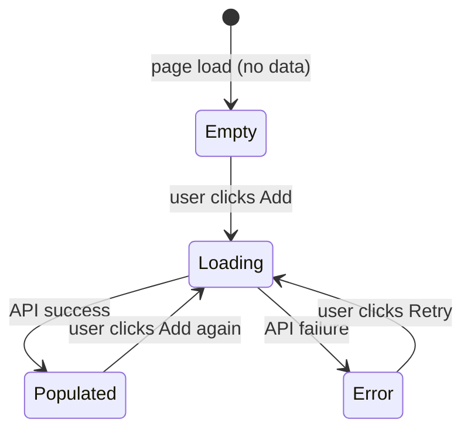

# GUI Spec

Elicits GUI specifications through structured dialogue, then generates Playwright acceptance tests that allow autonomous implementation and self-verification.

## When to Use

Called from `sprint plan` when one or more Stories involve GUI work. Do **not** call this during `sprint run` or `sprint verify` — specs must be finalized before implementation begins.

## Process

### Phase 1: Detect GUI Stories

Analyze the Sprint's Stories and Tasks. A Story involves GUI if it mentions:
- Component, screen, page, view, form, modal, dialog, drawer, panel
- UI, UX, frontend, React, htmx
- "display", "show", "render", "interact", "click", "input"

If no GUI Stories are found, skip this skill entirely and return to `sprint plan`.

### Phase 2: Derive Scenarios (one Story at a time)

For each GUI Story, reason through the following aspects and **auto-select the recommended approach** when a clear best practice or conventional answer exists. Only ask the user when a genuinely ambiguous design decision arises (e.g., multiple viable UX patterns with real trade-offs, domain-specific behavior that cannot be inferred from context).

**Aspects to reason through (adapt to context):**

1. **Entry point**: How does the user reach this UI? (direct URL, button click, navigation menu, etc.)
2. **Happy path**: The primary action flow — what the user does step by step and what happens after each step
3. **Data states**: What the UI shows when there is no data, when loading, and when an error occurs
4. **Edge cases**: Inputs or actions the UI should prevent or handle specially (empty fields, long strings, duplicate entries, etc.)
5. **Success feedback**: What the user sees after a successful action (toast, redirect, inline update, etc.)
6. **Failure feedback**: What the user sees when the action fails (server error, validation error, etc.)

**Auto-decision principle**: For each aspect, first determine if there is a clear recommendation based on existing project conventions, common UX patterns, or the Story context. If so, state your choice and rationale briefly and move on. If the decision is genuinely ambiguous (multiple viable approaches with meaningful trade-offs), ask the user — but batch related questions into a single message rather than asking one at a time.

Present the complete scenario summary (auto-decided items + any questions) to the user for a single confirmation pass, rather than iterating through each item individually.

**Autonomous mode** (when called from `sprint auto`): Skip the user confirmation pass entirely. Auto-decide all aspects, generate the state diagram and tests, and log all decisions to the Sprint's `decisions.md`. The scenario summary is still written to the spec document for post-hoc review, but no user interaction occurs.

### Phase 3: Generate State Transition Diagram

Based on the elicited scenarios, generate a Mermaid state diagram covering:
- All UI states (empty, loading, populated, error, submitting, success)
- All user actions that trigger transitions
- Which interactive elements (buttons, inputs) are enabled/disabled in each state

Present the diagram to the user as part of the scenario summary. If the user identifies missing states or transitions, update accordingly.

**Example output:**


### Phase 4: Generate Playwright Acceptance Tests

Convert the confirmed scenarios and state diagram into Playwright test cases. Write these as concrete, runnable test code.

**Rules for generated tests:**
- Use `data-testid` attributes for all selectors (never CSS classes or text content)
- Cover: happy path, empty state, loading state, error state, each edge case identified
- Use `page.route()` to mock API responses — do not depend on a real backend
- Each test must be independent (no shared state between tests)
- Name tests in the format: `「シナリオ名」should [expected behavior]`
- **Mock all dependent endpoints**: Explicitly mock every endpoint the component under test calls. If even one endpoint is unmocked, a silent fallback may cause the test to pass incorrectly.
- **Mock data must match real API contract**: Mock response data must match the actual API response shape. For paginated APIs (`{ items: [...] }`), return the wrapper as-is. Before writing mocks, read the project's backend handler files (e.g., `internal/api/*_handler.go` for Go, `app/controllers/` for Rails, `src/routes/` for Express) to confirm response structure.
- **Avoid overly broad URL wildcards**: Wildcards like `*/tenants` match paths that may not exist. Use specific paths where possible; if a wildcard is necessary, add a comment explaining why.
- **Verify all mocked endpoints are actually called**: At the end of each test, assert that mock handlers were called (e.g., `expect(mockHandler).toHaveBeenCalled()`). An uncalled mock may indicate a design mistake.
- **Verify endpoint registration before writing tests**: For every endpoint the test will mock, confirm it is registered in the backend router (e.g., `internal/api/router.go` for Go, or the project's equivalent routing file). If the endpoint does not exist yet, add a TODO comment in the test file: `// TODO: backend must implement POST /api/v1/auth/verify`. This prevents tests from silently passing against a frontend that calls non-existent endpoints.
- **Assert mutation request bodies against the backend contract**: For every POST/PUT/PATCH request, the mock handler MUST inspect `route.request().postDataJSON()` and assert that all required fields (as listed in the endpoint contract table) are present and non-empty. A mock handler that returns 201 without inspecting the request body will pass even when the frontend omits required fields — this is a silent false positive.

**Example:**
```typescript
import { test, expect } from '@playwright/test';

test('VM list: should show empty state when no VMs exist', async ({ page }) => {
  const listHandler = await page.route('/api/vms', route => route.fulfill({ json: [] }));
  await page.goto('/vms');
  await expect(page.getByTestId('empty-state-message')).toBeVisible();
  await expect(page.getByTestId('create-vm-button')).toBeEnabled();
  // Verify mock was called
  expect(listHandler).toHaveBeenCalled();
});

test('VM list: should show VM as running after start succeeds', async ({ page }) => {
  const listHandler = await page.route('/api/vms', route => route.fulfill({
    json: [{ id: 'vm-1', name: 'test-vm', status: 'stopped' }]
  }));
  const startHandler = await page.route('/api/vms/vm-1/start', route =>
    route.fulfill({ json: { status: 'running' } })
  );
  await page.goto('/vms');
  await page.getByTestId('vm-start-button-vm-1').click();
  await expect(page.getByTestId('vm-status-vm-1')).toHaveText('running');
  // Verify all mocks were called
  expect(listHandler).toHaveBeenCalled();
  expect(startHandler).toHaveBeenCalled();
});

test('VM create: should send required fields to backend', async ({ page }) => {
  const createHandler = page.route('/api/vms', async route => {
    if (route.request().method() === 'POST') {
      const body = route.request().postDataJSON();
      // Assert all required fields from the endpoint contract table
      expect(body.name).toBeTruthy();
      expect(body.flavor_id).toBeTruthy();
      return route.fulfill({ status: 201, json: { id: 'vm-1', name: body.name } });
    }
    return route.fulfill({ json: [] });
  });
  await page.goto('/vms');
  await page.getByTestId('vm-create-button').click();
  await page.getByTestId('vm-name-input').fill('my-vm');
  await page.getByTestId('vm-create-submit').click();
  await expect(page.getByTestId('vm-row-vm-1')).toBeVisible();
});
```

### Phase 4.5: Endpoint contract table

For each GUI Story, produce a contract table and include it in the spec document (`docs/sprint-logs/{SprintID}/gui-spec-{StoryID}.md`):

| Endpoint | Method | Router registration confirmed | Request fields (from handler) | Response fields (from handler) |
|---|---|---|---|---|
| `/api/v1/auth/verify` | POST | ✓ / ✗ | — | `status: string` |
| `/api/v1/organizations` | GET | ✓ / ✗ | — | `items: Organization[], next_cursor: string` |

**How to fill this table**:
- Read the project's router file (e.g., `internal/api/router.go` for Go, `config/routes.rb` for Rails, `src/routes/` for Express) to confirm each endpoint is registered. Mark ✗ if missing.
- Read the corresponding handler function to extract the exact field names from serialization annotations (Go JSON struct tags, Python serializer fields, etc.).
- The frontend API types **must** match the "Response fields" column exactly.

For each row where Method is POST/PUT/PATCH, the "Request fields" column defines what the Playwright test's mock handler **must** assert via `route.request().postDataJSON()`. Populate this column before writing tests — if it is left blank, the tests cannot verify the frontend is sending the correct body.

If any row has ✗ in "Router registration confirmed", flag it to `sprint plan` as a missing backend task before implementation begins.

### Phase 5: Update Roadmap

For each GUI Story, append the following to its entry in `docs/ROADMAP.md`:

```markdown
**Acceptance Criteria (GUI):**
- [ ] State diagram confirmed with user (see sprint-logs/{SprintID}/gui-spec-{StoryID}.md)
- [ ] Playwright tests pass: `npx playwright test {test-file}`
- [ ] All interactive elements have `data-testid` attributes
- [ ] API calls are mocked in tests (no real backend dependency)
```

Write the full spec output (state diagram + test code) to `docs/sprint-logs/{SprintID}/gui-spec-{StoryID}.md`.

Create the sprint-logs directory if it doesn't exist.

## Output Contract

This skill produces:
1. Confirmed Mermaid state diagram per GUI Story
2. Playwright test file at `tests/e2e/{story-slug}.spec.ts` (or equivalent path per project conventions)
3. Spec document at `docs/sprint-logs/{SprintID}/gui-spec-{StoryID}.md`
4. Updated acceptance criteria in `docs/ROADMAP.md`

`sprint run` implementation sub-agents must:
- Add `data-testid` to every interactive element
- Run `npx playwright test` and fix failures before marking the Story complete
- Never mark a GUI Story as `[x]` if Playwright tests are failing

## Important Behaviors

- **Auto-decide, then confirm once**: Reason through all aspects autonomously, auto-select when recommendations are clear, and present a single summary for user confirmation. Only ask individual questions when a design decision is genuinely ambiguous with meaningful trade-offs.
- **Diagram before tests**: Present the state diagram as part of the scenario summary. Tests derived from an unconfirmed diagram will likely be wrong.
- **Mock everything**: All tests use `page.route()` mocks. A test that requires a running backend is not acceptable — it cannot run autonomously in CI.
- **data-testid is mandatory**: If the implementation doesn't have `data-testid` attributes, Playwright tests become fragile. This is a non-negotiable convention.
- **Short-circuit if no GUI**: If no Stories in the Sprint involve GUI, skip immediately and tell `sprint plan` to continue without GUI spec.
- **Autonomous mode**: When invoked from `sprint auto`, skip all user confirmation steps. Auto-decide every aspect, write the spec document, and log decisions. No user interaction.
- **Read the handler, not the type name**: When generating mock data for Playwright tests, always read the actual backend handler to get response field names from serialization annotations. Never infer field names from type names or frontend conventions — backends often use different naming (e.g., Go `json:"ram_mb"` tags differ from the field name `RAMMB`, Python serializers may rename fields, etc.).
- **Assert POST bodies, not just responses**: For every mutation (POST/PUT/PATCH), the test must call `route.request().postDataJSON()` and assert every required field from the backend handler. A test that only checks the response shape or that the row appears in the list cannot detect a missing required field — the mock returns success regardless of what was sent.
