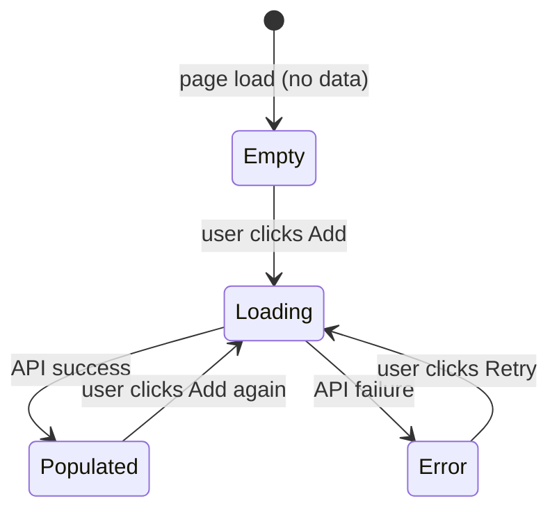

# GUI Spec (sprint reference)

The GUI-specification process used by `sprint plan` (and `sprint idea`). It elicits GUI specifications through structured dialogue, then generates Playwright acceptance tests that allow autonomous implementation and self-verification.

> This was previously a standalone `gui-spec` skill. It is now a reference of the `sprint` skill — it is only ever reached from `sprint plan` / `sprint idea`, so it does not need independent auto-discovery (which also avoids mis-firing on unrelated "form / modal / dashboard" wording). The process below is unchanged; `sprint plan` follows it inline instead of invoking a separate skill. Where the text below says "this skill", read it as "this process".

## Important Behaviors

- **Auto-decide, then confirm once**: Reason through all aspects autonomously, auto-select when recommendations are clear, and present a single summary for user confirmation. Only ask individual questions when a design decision is genuinely ambiguous with meaningful trade-offs.
- **Diagram before tests**: Present the state diagram as part of the scenario summary. Tests derived from an unconfirmed diagram will likely be wrong.
- **Two test files per Story**: E2E tests (real server, acceptance criteria) and mock tests (error/edge cases). Never mix them in the same file. The E2E shape is governed by `test-discipline.md` Rules 2 and 4 (real browser, real backend, no network mocks, UI-state assertions).
- **E2E tests trace to acceptance criteria**: Every E2E test name must start with `[AC-{StoryID}-{N}]` matching an acceptance criterion in ROADMAP.json. Every acceptance criterion must have at least one E2E test.
- **data-testid is mandatory**: If the implementation doesn't have `data-testid` attributes, Playwright tests become fragile. This is a non-negotiable convention.
- **Short-circuit if no GUI**: If no Stories in the Sprint involve GUI, skip immediately and return to `sprint plan`.
- **Autonomous mode**: When invoked from `sprint auto`, skip all user confirmation steps. Auto-decide every aspect, write the spec document, and log decisions to `decisions.json`.
- **Read the handler, not the type name**: Always read the actual backend handler for response field names. Never infer from type names or frontend conventions.
- **Assert POST bodies in mock tests**: For every mutation, inspect `route.request().postDataJSON()` and assert required fields. In E2E tests, verify via GET that the mutation persisted instead.
- **Time-domain AC require progression sampling**: An AC about animation, smooth scroll, transition, debounce/throttle, or async layout coordination (`[time-domain]` tag) cannot be verified by a final-state-only assertion. See `time-domain-tests.md`.

## When to Use

Called from `sprint plan` when one or more Stories involve GUI work. Do **not** call this during `sprint run` or `sprint verify` — specs must be finalized before implementation begins.

## Process

### Phase 1: Detect GUI Stories

Analyze the Sprint's Stories and Tasks. A Story involves GUI if **any** of the following holds:

1. **Project-level signal (default-on rule)**: The project has a frontend stack — i.e., `package.json` lists React / Vue / Svelte / Solid / Preact / Angular / Next / Nuxt / Remix / Astro, OR the codebase contains `htmx` / Hotwire / Phoenix LiveView / similar server-rendered interactive templates. **In such projects, any Story that exposes a feature a user can observe in a browser is a GUI Story by default**, even if the wording focuses on backend behavior. The only exceptions are Stories that are *exclusively* CLI / batch / internal-API / library work with no user-visible browser surface.
2. **Story wording**: Mentions component, screen, page, view, form, modal, dialog, drawer, panel; UI, UX, frontend, React, htmx; or verbs like "display", "show", "render", "interact", "click", "input".
3. **Acceptance criteria**: An AC describes something a user sees or does in a browser (e.g., "user sees X", "the list updates", "a toast appears").

**Classifying a Story as non-GUI is a high-cost decision** — it removes the Playwright E2E requirement and the user has explicitly asked for end-to-end frontend↔backend verification. Do not use the non-GUI label as an escape hatch for "I'd rather just curl the API". If the project has a frontend AND the feature will eventually be reachable from the UI, treat it as GUI.

When you do classify a Story as non-GUI, log a decision entry to `docs/sprint-logs/{SprintID}/decisions.json` with:
- The Story ID and title
- The reason it has no browser-observable surface (be specific: "this is a cron job that writes to S3, no UI consumes it in this Sprint")
- A reference to the codebase / VISION justifying the classification

If no GUI Stories remain after applying the rules above, skip this skill entirely and return to `sprint plan`.

### Phase 2: Derive Scenarios (one Story at a time)

For each GUI Story, reason through the following aspects and **auto-select the recommended approach** when a clear best practice or conventional answer exists. Only ask the user when a genuinely ambiguous design decision arises (e.g., multiple viable UX patterns with real trade-offs, domain-specific behavior that cannot be inferred from context).

**Aspects to reason through (adapt to context):**

1. **Entry point**: How does the user reach this UI? (direct URL, button click, navigation menu, etc.)
2. **Happy path**: The primary action flow — what the user does step by step and what happens after each step
3. **Data states**: What the UI shows when there is no data, when loading, and when an error occurs
4. **Edge cases**: Inputs or actions the UI should prevent or handle specially (empty fields, long strings, duplicate entries, etc.)
5. **Success feedback**: What the user sees after a successful action (toast, redirect, inline update, etc.)
6. **Failure feedback**: What the user sees when the action fails (server error, validation error, etc.)

**Auto-decision principle**: For each aspect, first determine if there is a clear recommendation based on existing project conventions, common UX patterns, or the Story context. If so, state your choice and rationale briefly and move on. If the decision is genuinely ambiguous (multiple viable approaches with meaningful trade-offs), ask the user — but batch related questions into a single message rather than asking one at a time.

Present the complete scenario summary (auto-decided items + any questions) to the user for a single confirmation pass, rather than iterating through each item individually.

**Autonomous mode** (when called from `sprint auto`): Skip the user confirmation pass entirely. Auto-decide all aspects, generate the state diagram and tests, and log all decisions to the Sprint's `decisions.json`. The scenario summary is still written to the spec document for post-hoc review, but no user interaction occurs.

### Phase 3: Generate State Transition Diagram

Based on the elicited scenarios, generate a Mermaid state diagram covering:
- All UI states (empty, loading, populated, error, submitting, success)
- All user actions that trigger transitions
- Which interactive elements (buttons, inputs) are enabled/disabled in each state

Present the diagram to the user as part of the scenario summary. If the user identifies missing states or transitions, update accordingly.

**Example output:**

### Phase 4: Generate Playwright Tests + Endpoint Contracts

For each GUI Story, generate:

1. **E2E test file** at `tests/e2e/{story-slug}.e2e.spec.ts` — real-browser tests covering acceptance criteria, run during `sprint verify`
2. **Mock test file** at `tests/e2e/{story-slug}.mock.spec.ts` — frontend-only tests for empty / loading / error / edge states, run during `sprint run`
3. **Time-domain tests** (only if an AC describes motion-over-time) using the progression-sampler pattern
4. **Endpoint contract table** added to `docs/sprint-logs/{SprintID}/gui-spec-{StoryID}.json` — read router and handlers to fill exact field names

The full rules — naming, setup/teardown patterns, mock request-body assertions, time-domain template, endpoint contract format — live in `gui-spec-test-generation.md`. Read that file before writing any test.

### Phase 5: Update Roadmap and Write Spec

1. **Update `docs/ROADMAP.json`**: Add GUI-specific acceptance criteria to each GUI Story's `acceptance_criteria` array:
   - State diagram confirmed
   - Mock tests pass
   - E2E tests pass (during sprint verify)
   - All interactive elements have `data-testid` attributes
   - Every AC has a corresponding `[AC-*]` tagged E2E test

2. **Write spec file**: Write the full spec output to `docs/sprint-logs/{SprintID}/gui-spec-{StoryID}.json` following the `gui_spec` structure in SPRINT_LOGS_SCHEMA.json. This includes: state diagram (Mermaid string), scenarios, endpoint contracts, and test file paths.

Create the sprint-logs directory if it doesn't exist.

## Output Contract

This skill produces:
1. Confirmed Mermaid state diagram per GUI Story
2. E2E test file at `tests/e2e/{story-slug}.e2e.spec.ts` — real server tests for acceptance criteria
3. Mock test file at `tests/e2e/{story-slug}.mock.spec.ts` — error/edge case tests with mocks
4. Spec document at `docs/sprint-logs/{SprintID}/gui-spec-{StoryID}.json`
5. Updated acceptance criteria in `docs/ROADMAP.json`

`sprint run` implementation sub-agents must:
- Add `data-testid` to every interactive element
- Run `npx playwright test {story-slug}.mock.spec.ts` and fix failures before marking the Story complete
- E2E tests (`*.e2e.spec.ts`) are NOT run during sprint run — they run during sprint verify against the real server

## Reference Files

- `gui-spec-test-generation.md` — **read this before writing any test** — E2E rules, mock rules, time-domain rules, endpoint contract format
- `gui-spec-test-examples.md` — E2E and mock test code examples
- `time-domain-tests.md` — time-domain AC schema, Playwright template, forbidden patterns, fix workflow
